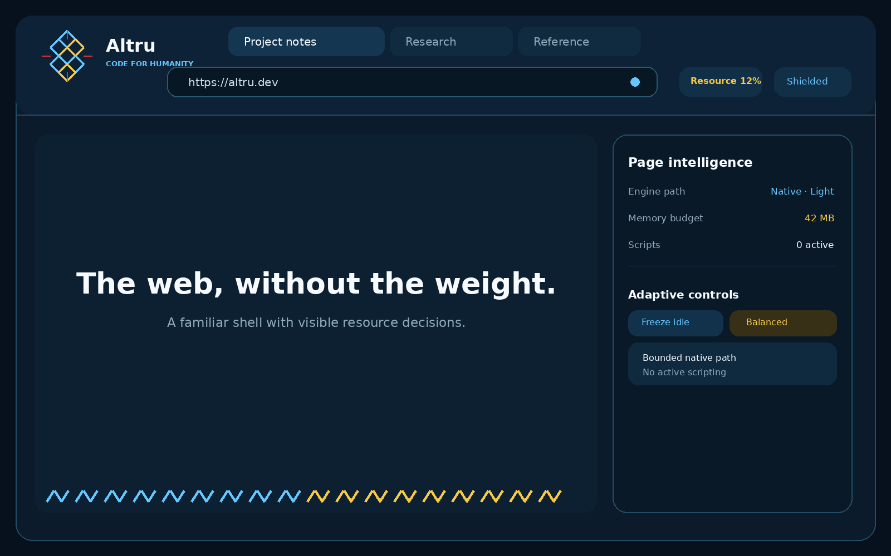
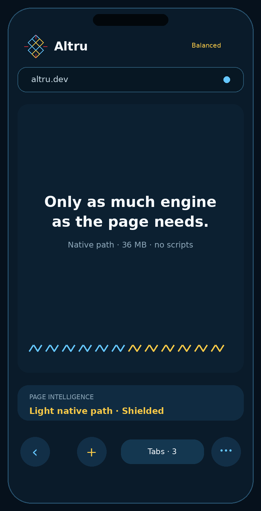

<p align="center">
  
</p>

# Altru Browser

**Code for Humanity.**

Altru Browser is an independent, adaptive browser project from Altru.dev. Its native engine is being built to use only the capabilities a page actually needs while keeping browser semantics, security boundaries, and execution evidence explicit.

The engine is developed under the engineering codename **Adaptive Web Engine Fabric (AWEF)**. Frequency is used privately as a development and assurance layer; Frequency internals are not part of this repository.

## Current status

Altru Browser is **experimental**. It is not yet a general-purpose replacement for Chrome, Firefox, Safari, or Edge.

The current native path includes:

- an owned document model and HTML parser;
- an owned bounded CSS parser, selector model, cascade, inheritance, custom properties, and invalidation;
- an owned layout and retained-scene boundary;
- deterministic rendering and SHA-256 execution evidence;
- a cross-platform PlatformHost contract;
- Linux runtime verification;
- compile verification for Windows, macOS, Android, and iOS;
- optional Taffy geometry experiments behind an owned layout boundary;
- an optional Servo 0.6.0 compatibility adapter used as a reference/bootstrap path, not as the long-term browser identity.

No capability is advertised as production-ready until its evidence gate is satisfied.

## Product direction

The browser shell is intentionally familiar enough to use immediately while avoiding a Chrome/Safari clone. The current visual direction keeps a top URL bar, makes adaptive resource decisions visible, and uses a restrained Ukrainian vyshyvanka-inspired geometry as structural identity.

### Desktop



### Mobile

<p align="center">
  
</p>

These are design-direction artifacts, not screenshots of a production-ready browser. See `docs/BRAND.md` and `assets/README.md`.

## Architecture

```text
Altru Browser
    |
    +-- Browser / Navigation Kernel
    |
    +-- Native Document Runtime
    |     +-- DOM + HTML
    |     +-- CSS + cascade
    |     +-- invalidation
    |     +-- layout contracts
    |     +-- retained scene
    |
    +-- Renderer abstraction
    |
    +-- PlatformHost
          +-- Linux
          +-- Windows
          +-- macOS
          +-- Android
          +-- iOS
```

Third-party libraries may provide bounded primitives. They do not become semantic authority for Altru Browser.

## Development principles

1. **Own browser semantics.** DOM, HTML, CSS cascade, navigation, lifecycle, security policy, and evidence contracts stay behind Altru-owned interfaces.
2. **Fail closed.** Unsupported or ambiguous behavior must not silently become a successful native result.
3. **Evidence before promotion.** Tests, independent comparisons, platform checks, and deterministic evidence precede capability claims.
4. **Cross-platform by contract.** Platform-specific APIs stay behind PlatformHost boundaries.
5. **No unnecessary telemetry.** The project should not require behavioural telemetry to function.
6. **Open implementation, bounded private assurance.** Public browser code is separated from private Frequency reasoning, credentials, customer data, and private policy state.

## Verify locally

```bash
cargo fmt --check
cargo clippy --all-targets -- -D warnings
cargo test
cargo test --release
cargo test --features taffy-layout
scripts/verify-native-platforms.sh
```

Optional Servo compatibility gate:

```bash
cargo check --features servo-engine
cargo test --features servo-engine
```

See `docs/NATIVE-ENGINE-ROADMAP.md`, `docs/NATIVE-DDC-GATE.md`, `docs/PLATFORM-MATRIX.md`, and `evidence/native-n2-vps.md` for the present implementation and verification boundary.

## Project documentation

- `ARCHITECTURE.md` — owned semantic and platform boundaries.
- `ROADMAP.md` — capability progression and promotion order.
- `DEVELOPMENT.md` — local build, verification and evidence workflow.
- `GOVERNANCE.md` — project decision model and maintainer responsibilities.
- `docs/PROJECT-STATUS.md` — what is verified and what is not claimed.
- `docs/CONFORMANCE.md` — standards and test authority.
- `docs/THREAT-MODEL.md` — current security boundary and known gaps.
- `docs/PRIVACY.md` — data-minimization principles.
- `docs/RELEASE-PROCESS.md` — evidence-gated release procedure.
- `docs/OPEN-SOURCE-BOUNDARY.md` — clean public/private development boundary.

The public Git history is intentionally independent from the private experimental development history.

## Community

Contributions that improve standards conformance, portability, security, deterministic testing, resource efficiency, accessibility, or developer experience are welcome. See `CONTRIBUTING.md`.

Security issues should not be filed publicly. See `SECURITY.md`.

## Licensing

Unless a file says otherwise, Altru Browser is dual-licensed under your choice of:

- **MIT License** — see `LICENSE-MIT`; or
- **Apache License 2.0** — see `LICENSE-APACHE`.

Third-party dependencies keep their own licenses; see `THIRD_PARTY_NOTICES.md` and `docs/DEPENDENCY-REVIEW.md`. Project branding is governed separately from the source-code licenses; see `TRADEMARKS.md`.

Copyright © 2026 Valentyn Rukhaylo / Altru.dev.
